# Quantumult

* `系统要求：iOS 9 及以上`
* `设备要求：iPhone / iPad`
* `此应用已在国区下架，请使用非国区 Apple ID 下载。`
* `我们为绑定非国区支付方式困难的订阅客户准备了下载帐户，如需要请在网站内开服务单索取`

## 介绍     

Quantumult是目前iOS上支持最好的客户端，支持订阅功能，但设置略复杂

## 下载

版本:  2.2.9 

[在线安装](https://gogoyun.xyz/quantumult/index.html)

请使用iPhone/iPad自带浏览器Safari打开在线安装链接，安装完毕后第一次登录会需要输入AppStore密码，为防止滥用我们未公布该密码，请向客服索取

## 服务器订阅

* 手机浏览器打开 [常青藤用户中心](https://ivynet.fun/clientarea.php) ，点击已订阅套餐，在套餐详情中点击**Quantumult 专用链**，订阅信息会自动复制进剪贴板

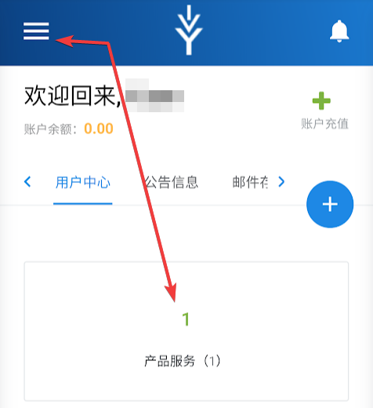

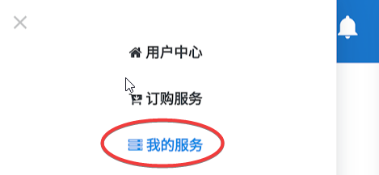

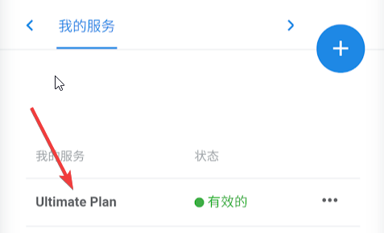

* 打开Quantumult，**设置**选项卡，点击**订阅**

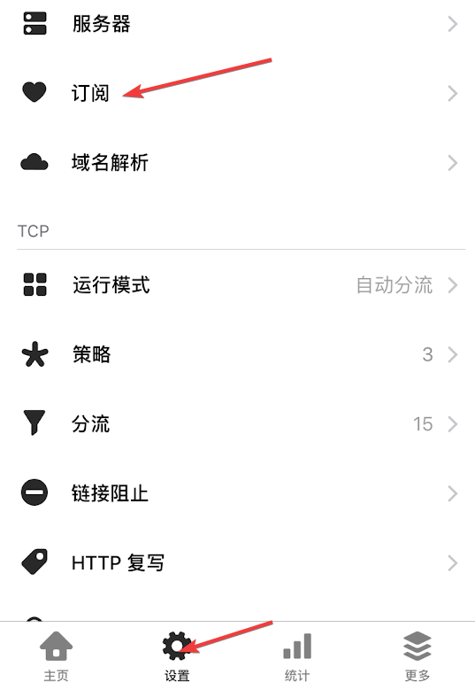

* 打开菜单里，点击**右上+号**，弹出菜单选择**服务器**

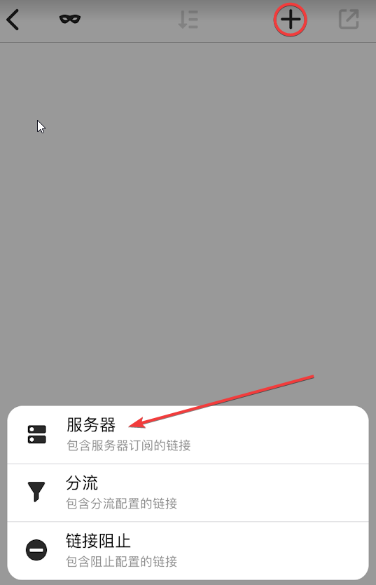

* 打开的服务器信息窗口中，**链接**位置粘贴**Quantumult专用链**，并打开**更新检测**并**保存**。Quantumult会自动下载套餐对应的服务器节点信息

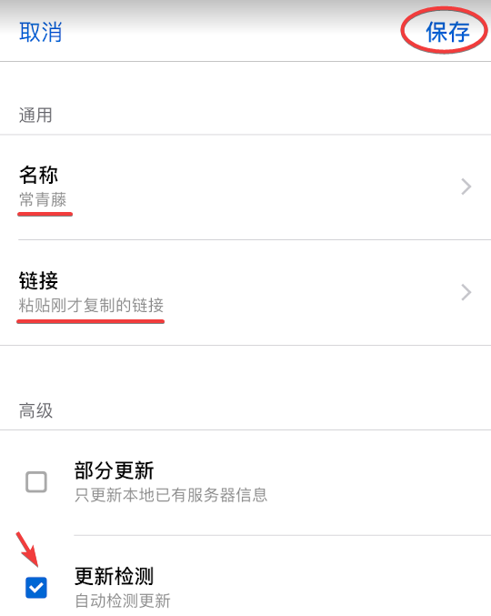

* 点击Quantumult Logo图标，可以看到所有节点并自由切换，带有简易的延迟测试

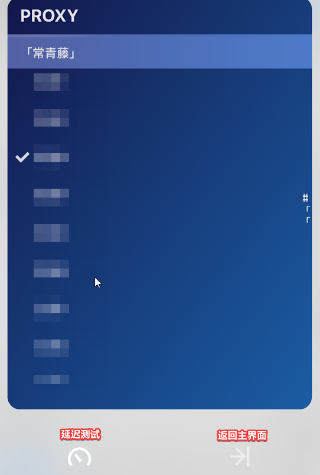

* 选中节点后，点击**首页**选项卡，打开**右上角开关**即可开启代理

* 首次使用系统会提示配置VPN，允许后需要使用指纹/Face ID/密码 确认

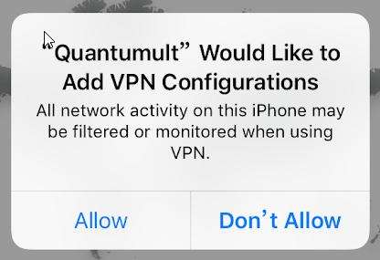

## 可选配置 - 规则订阅

* Quantumult内置了一个分流规则，大部分情况效果不错，但是还是会有规则匹配不正确的情况。用户可以选择自定义更为完善的规则。
* 规则仅在**运行模式 - 自动分流**模式下生效
* 推荐规则：[lhie1规则](https://github.com/lhie1/Rules)。目前维护最为完善的规则，包含了分流策略，去广告，拦截隐私跟踪等功能
* 订阅地址：
  * 分流规则：[https://raw.githubusercontent.com/lhie1/Rules/master/Quantumult/Quantumult.conf](https://raw.githubusercontent.com/lhie1/Rules/master/Quantumult/Quantumult.conf)
  * 阻止规则：[https://raw.githubusercontent.com/lhie1/Rules/master/Quantumult/Quantumult\_URL.conf](https://raw.githubusercontent.com/lhie1/Rules/master/Quantumult/Quantumult_URL.conf)
* **设置**选项卡，点击**订阅**，**右上角+号**，和设置服务器订阅一样分别设置分流规则和链接阻止规则

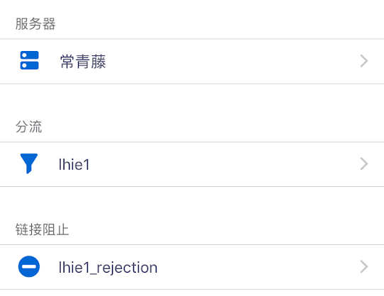

* 在两条订阅规则上分别向左滑，点击**替换**

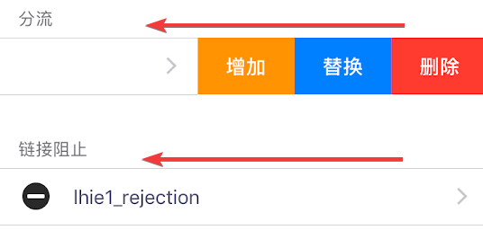

* 更新分流规则时，系统会提供选项自定义规则，根据提示选择后保存即可

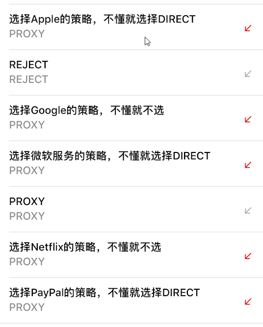

