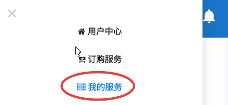

# BifrostV

## 介绍

BifrostV是一款适用于常青藤的Android客户端，不支持订阅功能，但能通过导入URL一次性导入所有节点。

## 下载安装

版本:0.6.5 \| 更新日期: 2018-12-14

[本地下载](https://xn--rut069fptl.club/dl.php?type=d&id=15) \| [PlayStore下载](https://play.google.com/store/apps/details?id=com.github.dawndiy.bifrostv)

**BifrostV为免费工具，但免费版会有少量广告，介意的用户可以在设置中付费关掉广告**

## 使用

* 手机浏览器打开 [常青藤用户中心](https://xn--rut069fptl.club/clientarea.php) ，点击已订阅套餐（左上三横线-我的服务，或直接在首页点击产品服务），在套餐详情中点击 **通用订阅链** ，订阅信息会自动复制进剪贴板

* 打开刚安装好的BifrostV，点击右上的**添加**，选择**从URL导入**，在**弹出窗口里**粘贴之前复制的**通用订阅链，确定保存**

* 导入订阅链后，套餐对应的所有节点会自动加载到BifrostV，但与v2rayNG订阅不同的是，BifrostV无法根据订阅链更新节点信息，多次导入将会出现大量重复节点。
* 导入节点后，选择需要使用的节点，然后点击右下角V字图标，第一次运行会跳出允许BifrostV设置VPN连接的请求，确定后即可开启代理

