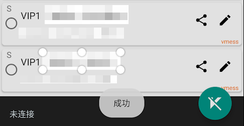

# V2RayNG（推荐）

## 介绍

V2RayNG是一款适用于常青藤的开源Android客户端，支持订阅功能。

## 下载安装

版本:0.6.7 \| 更新日期: 2018-12-25

[本地下载](https://ivynet.fun/dl.php?type=d&id=14) \| [官方下载](https://github.com/2dust/v2rayNG/releases/download/0.6.7/app-universal-release.apk) \| [PlayStore下载](https://play.google.com/store/apps/details?id=com.v2ray.ang)

## 使用

* 手机浏览器打开 [常青藤用户中心](https://ivynet.fun/clientarea.php) ，点击已订阅套餐（左上三横线-我的服务，或直接在首页点击产品服务），在套餐详情中点击 **通用订阅链** ，订阅信息会自动复制进剪贴板

* 打开刚安装好的V2RayNG，点击**左上三横线** 小标 ，在弹出的窗口中，选择订阅设置

* 进入订阅设置后，点击**右上+号**，在弹出窗口填入对应信息，保存

* 保存后返回V2RayNG主界面，点击**右上三点**，选择更新订阅，成功后即可导入订阅套餐对应的所有节点

* 按需求选择节点后，点击右下角V字图标，第一次运行会跳出允许v2rayNG设置VPN连接的请求，确定后即可开启代理

## 设置

为了更好的体验，我们需要对v2rayNG进行一些设置，点击**左上三横线**小图标，选择**设置**

* 路由设置，建议选择**绕过局域网及大陆地址**，访问国内网站时，流量不经过v2rayNG，

* 如果开启v2rayNG后，无法访问Google Play Store，那么需要在**自定路由**里代理的网址或IP里填入services.googleapis.cn并保存

## 分应用代理

* 分应用代理设置能让v2rayNG更好的处理手机的流量
* 分应用代理打开，绕行模式关闭，则为选中的应用的流量将使用代理，其他的则直连

* 分应用代理打开，绕行模式打开，则为选中的应用的流量不使用代理，未选中的APP将使用v2rayNG

