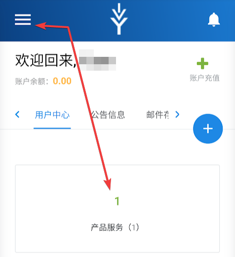
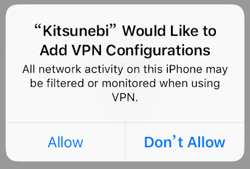
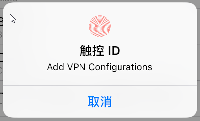
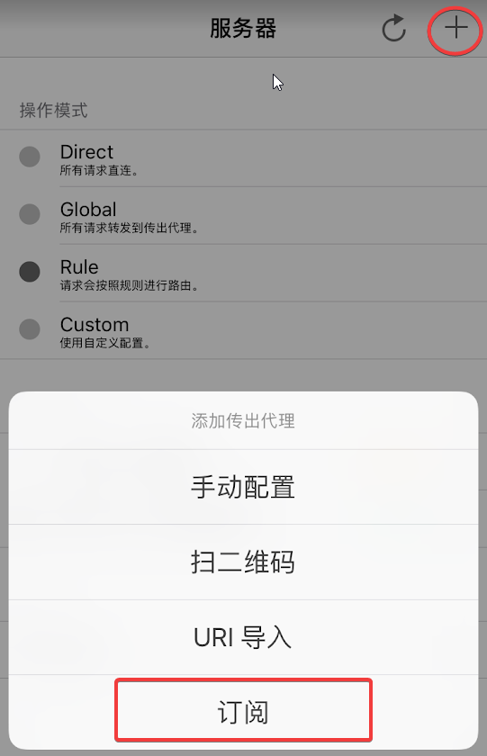
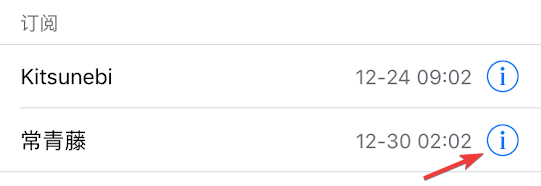
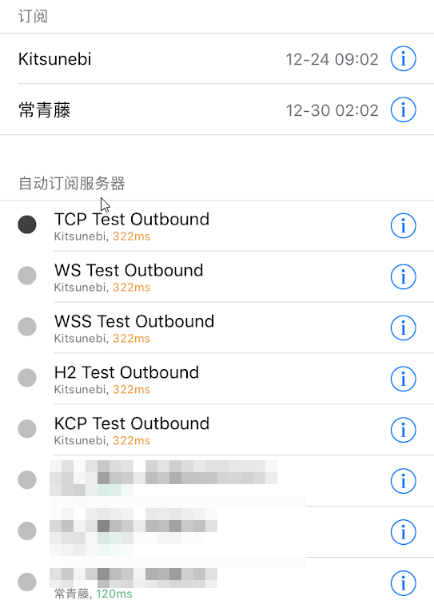
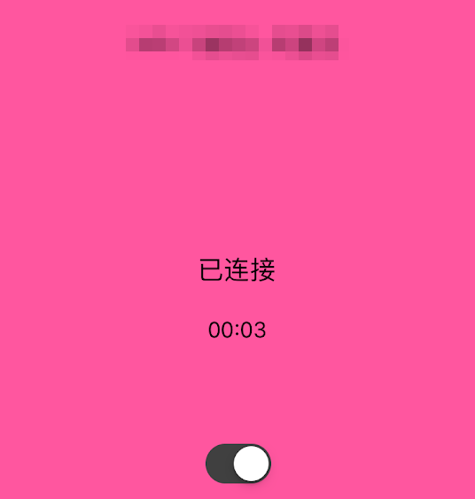

# Kitsunebi

* `系统要求：iOS 9 及以上`
* `设备要求：iPhone / iPad`
* `此应用已在国区下架，请使用非国区 Apple ID 下载。`
* `我们为绑定非国区支付方式困难的订阅客户准备了下载帐户，如需要请在网站内开服务单索取`

## 介绍    

Kitsunebi是专门为V2Ray设计的代理工具，目前在iOS上对V2Ray协议支持最为全面的工具，但稳定性上相比其他两款工具稍差。

## 服务器订阅

* 手机浏览器打开 [常青藤用户中心](https://ivynet.fun/clientarea.php) ，点击已订阅套餐（左上三横线-我的服务，或直接在首页点击产品服务），在套餐详情中点击 **通用订阅链** ，订阅信息会自动复制进剪贴板

* 首次打开Kitsunebi，系统会提示配置VPN，允许后要使用指纹/Face ID/密码 确认

* 打开Kitsunebi，选择**服务器**选项卡，然后点击**右上+号**，在跳出菜单中点击**订阅**

* **URL**位置粘贴刚才复制的**订阅链**，打开自动更新，然后存储

* 回到服务器界面，可以看到斑马线的订阅已添加，点击订阅详情图标

* 点击从URL更新，即可获取套餐对应的所有节点

* 选中需要节点后切换到**状态**选项卡，打开开关即可开启代理

