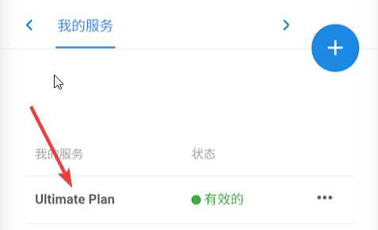

# ShadowRocket（推荐）

* `系统要求：iOS 9 及以上`
* `设备要求：iPhone / iPad`
* `此应用已在国区下架，请使用非国区 Apple ID 下载。`
* `我们为绑定非国区支付方式困难的订阅客户准备了下载帐户，如需要请在网站内开服务单索取`

## 介绍

ShadowRocket俗称小火箭，是一款iOS上非常受欢迎的代理工具

* 中国区有同名山寨软件，请认准开发者Guangming Li

## 服务器订阅

* 手机浏览器打开 [常青藤用户中心](https://xn--rut069fptl.club/clientarea.php) ，点击已订阅套餐（左上三横线-我的服务，或直接在首页点击产品服务），在套餐详情中点击 **通用订阅链** ，订阅信息会自动复制进剪贴板

* 打开Shadowrocket，点击**右上+号**，弹出窗口中点击**类型，**并将类型更改为**Subscribe**

* 将**通用订阅链**粘贴至**URL位置**，点击**完成**即可更新订阅

* 如更新地址失败，可在主界面主订阅上向左滑动，点击更新

* 更新订阅成功后，选择需要节点，主界面点击**开关**即可开启代理。
* 首次使用系统会提示配置VPN，允许后需要使用指纹/Face ID/密码 确认

* 打开订阅自动更新：设置选项卡，服务器订阅，启用打开时更新。这样每次启动shadowrocket，都会自动从斑马线更新最新的节点信息，保持和服务器同步

## 可选配置 - 规则

Shadowrocket内置了一个分流规则，大部分情况效果不错，但是还是会有规则匹配不正确的情况。在选项卡配置里，用户可以选择自定义更为完善的规则。

* 规则仅在**全局路由 - 配置**模式下生效
* 推荐规则：[lhie1规则](https://raw.githubusercontent.com/lhie1/Rules/master/Shadowrocket.conf)。目前维护最为完善的规则，包含了分流策略，去广告，拦截隐私跟踪等功能
* 订阅地址：[https://raw.githubusercontent.com/lhie1/Rules/master/Shadowrocket.conf](https://raw.githubusercontent.com/lhie1/Rules/master/Shadowrocket.conf)
* 打开shadowrocket**配置**选项卡，点击**添加配置**，跳出窗口里粘贴上面的**订阅地址**后点击下载 

* 添加完成后，点击远程文件链接，弹出窗口点击**使用配置**

* shadowrocket会将规则下载到本地并自动启用

