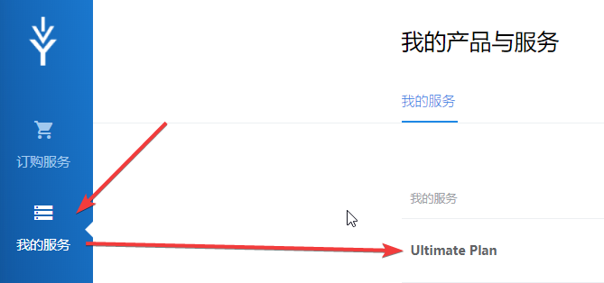
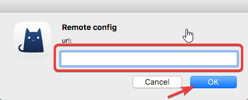
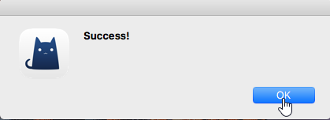
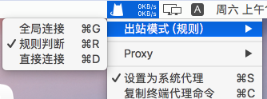
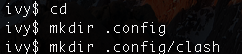

# ClashX（推荐）

* `系统要求：macOS 10.5 及以上`
* `设备要求：MacBook / iMac / Mac Pro`

## 介绍

ClashX是个适用于V2Ray的图形化客户端，内核Clash整合了V2Ray，并具有强大的路由功能。本站目前支持Clash的订阅托管模式

## 下载

版本:v1.8.1 \| 更新日期: 2018-12-23

[本地下载](https://xn--rut069fptl.club/dl.php?type=d&id=13) \| [官方下载](https://github.com/yichengchen/clashX/releases/download/1.8.1/ClashX.dmg)

## 运行

* 双击您下载的文件，将ClashX拖动到Lunchpad或任意位置。
* 第一次安装可能会需要输入当前用户密码
* 点击运行ClashX

## 配置订阅并开启ClashX

* 进入您的[产品中心](https://xn--rut069fptl.club/clientarea.php)，点击对应套餐进入套餐详情，用户信息区域，订阅区域点击**Clash订阅链。**




* 打开ClashX，点击顶部菜单栏ClashX图标，配置 - 托管配置 - 设置地址


* 跳出窗口中，粘贴刚才复制的Clash订阅链，确定保存，导入成功后会显示Success





* 在Proxy里应该能看到所有节点了，按需求任意选择。同时勾选设为系统代理，显示事实速率


* 设置出站模式（规则）
  * 全局：所有流量都经过加速服务器
  * 规则：只有海外流量会经过加速服务器，并且包含了部分去广告去隐私跟踪规则
  * 直连：所有流量都不经过加速服务器



## 已知问题

极少数用户安装后订阅时显示config文件不存在，估计由于权限问题导致ClashX安装时无法正确创建运行所需文件夹，解决办法如下：

* 退出ClashX，打开命令行工具（Lunchpad-&gt;其他-&gt;终端）


* 输入以下命令

```text
cd
mkdir .config
mkdir .config/clash
```



* 重启ClashX即可解决此问题

