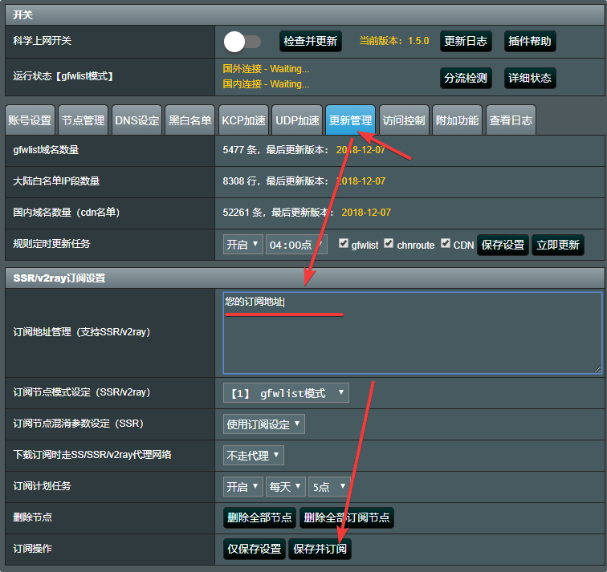
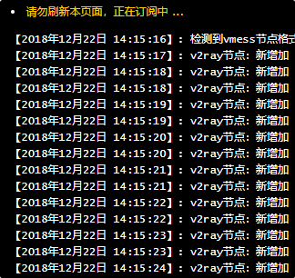
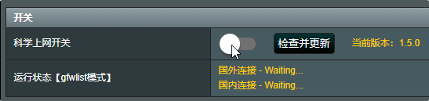

# 梅林固件

## 在线安装

通过浏览器访问 路由器 管理页面，在管理页面底部点击「软件中心」，然后点击「未安装」选项卡，然后点击「科学上网」进行安装。

## 离线安装

* 因为一些不可抗因素，有时商店会将「科学上网」插件下架，我们可以使用离线安装。
* 通过浏览器访问梅林科学上网插件的官方发布页[https://github.com/hq450/fancyss](https://github.com/hq450/fancyss)，下载对应机型的离线安装包
* 下载离线安装包后将文件名更改为shadowsocks.tar.gz
* 通过浏览器访问 Koolshare Merlin ROM 管理页面，在管理页面底部点击「软件中心」，然后点击离线安装选项卡，选择刚才下载更名的文件，点击上传并安装

## 配置与使用

点击「已安装」选项卡中的「科学上网」进入插件管理页面。

如果是第一次使用此插件，则可能弹出此会话框：

点击「更新管理」按钮进入更新管理页面，将**通用订阅链**粘贴于订阅地址管理右侧的输入框中，点击「保存并订阅」按钮。

订阅中...

订阅完成后，页面会自动跳转到主页面，此时 KoolSS 的开关可能会处于关闭状态，点击开关来打开它，打开后可以看到国外链接已可以正常访问

* 由于普通家用路由器其使用的 CPU 大都为 MIPS 或 ARMv7 架构，其性能可能不足，因此可能无法达到较高速率。
* 以下是各常见路由型号大致连接速率：

| 型号 | 品牌 | 大致连接速率 |
| :--- | :--- | :--- |
| R6300v2 | NETGEAR | 30Mbps |
| R6400 | NETGEAR | 30Mbps |
| R6900 | NETGEAR | 60Mbps |
| R7000 | NETGEAR | 70Mbps |
| R8000 | NETGEAR | 未经测试 |
| R8500 | NETGEAR | 110Mbps |
| RT-N66U | ASUS | 未经测试 |
| RT-AC56U | ASUS | 20Mbps |
| RT-AC66U | ASUS | 30Mbps |
| RT-AC68U | ASUS | 60Mbps |
| RT-AC87U | ASUS | 70Mbps |
| RT-AC88U | ASUS | 70Mbps |
| RT-AC86U | ASUS | 180Mbps |
| RT-AC1900P | ASUS | 70Mbps |
| RT-AC3100 | ASUS | 未经测试 |
| RT-AC3200 | ASUS | 未经测试 |
| RT-AC66U-B1 | ASUS | 60Mbps |
| RT-AC5300 | ASUS | 120Mbps |
| GT-AC5300 | 玩家国度 | 250Mbps |
| EA6200 | Linksys | 未经测试 |
| EA6400 | Linksys | 未经测试 |
| EA6700 | Linksys | 未经测试 |
| EA6500v2 | Linksys | 未经测试 |
| EA6900 | Linksys | 未经测试 |

