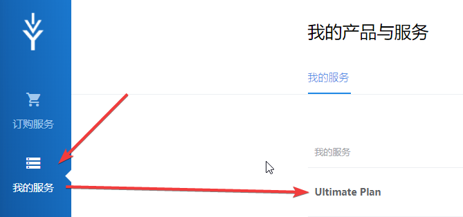
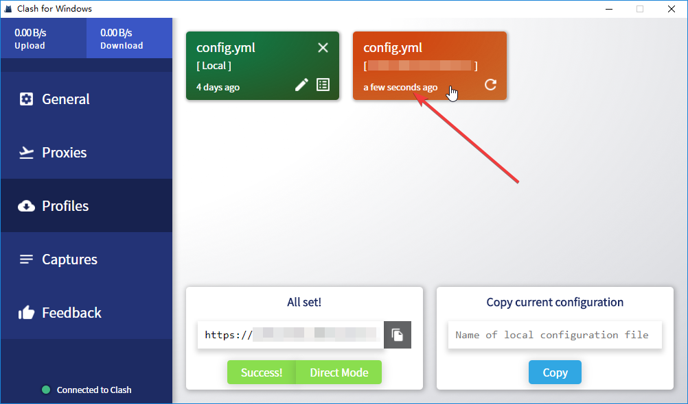
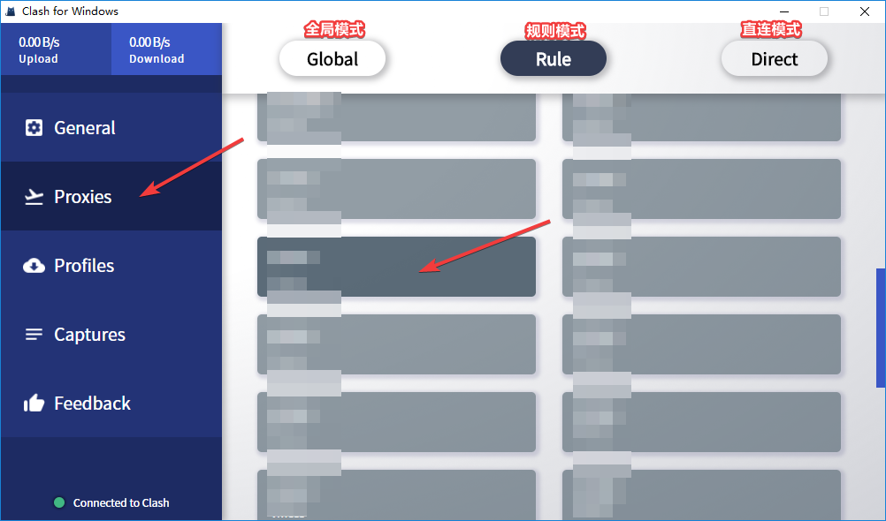
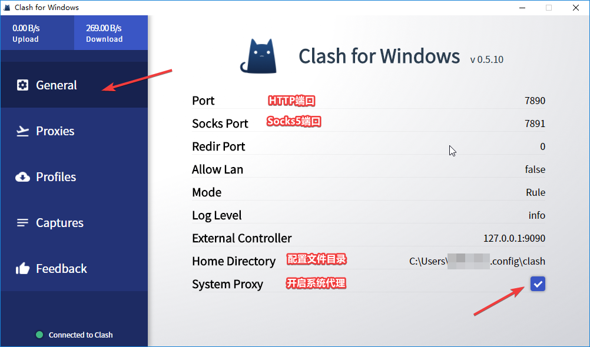

# Clash For Win（推荐）

* `系统要求：Windows XP 及以上（64-bit）`

## 介绍

Clash For Win是个适用于V2Ray的图形化客户端，内核Clash整合了V2Ray，并具有强大的路由功能。本站目前支持Clash的订阅托管模式

## 下载

版本:v0.5.13 \| 更新日期: 2018-12-28

绿色解压版

[本地下载](https://ivynet.fun/dl.php?type=d&id=10) \| [官方下载](https://github.com/Fndroid/clash_for_windows_pkg/releases/download/0.5.13/Clash.for.Windows-0.5.13-win.zip)

安装版

[本地下载](https://ivynet.fun/dl.php?type=d&id=9) \| [官方下载](https://github.com/Fndroid/clash_for_windows_pkg/releases/download/0.5.13/Clash.for.Windows.Setup.0.5.13.exe)

## 运行

* 将您下载的压缩包解压到任意目录，建议放在非系统盘的目录里，避免带来权限问题。
* 运行其中的 `Clash for Windows.exe`
* Windows 10 第一次运行可能会提示被阻止，点击更多信息」 - 「仍要运行」

## 配置订阅并开启Clash

* 进入您的[产品中心](https://ivynet.fun/clientarea.php)，点击对应套餐进入套餐详情，用户信息区域，订阅区域点击**Clash订阅链。**

* 打开Clash For Windows，点击Profiles，在Download remote configuration file粘贴刚才复制的订阅链，然后点击Download

* 下载完成后，上方会多出一个订阅卡片，点击该卡片启用该订阅

* 然后点击Proxies，能看到所有节点已经导入，点击卡片选择节点
* 点击Proxies，能看到所有节点已经导入，点击卡片选择节点，并且在模式中选择：
  * 全局模式：所有流量都经过加速服务器
  * 规则模式：只有海外流量会经过加速服务器，并且包含了部分去广告去隐私跟踪规则
  * 直连模：所有流量都不经过加速服务器
* 规则模式规则已整合在订阅中，使用的是目前效果较好的lhie1规则，每7天服务器会自动更新一次。感谢lhie1大佬维护

* 最后点击General，可以看到目前配置信息，勾选System Proxy开启系统代理

