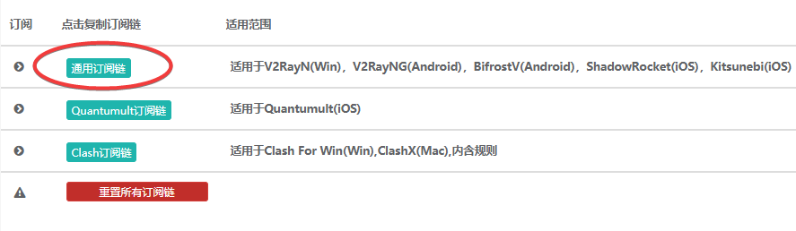
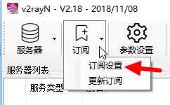
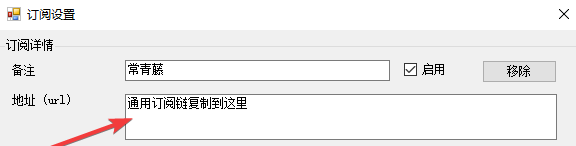
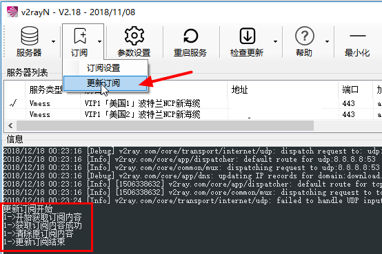
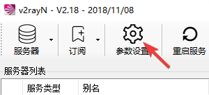
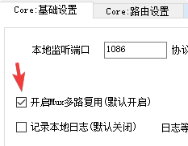
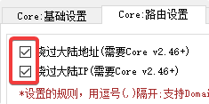
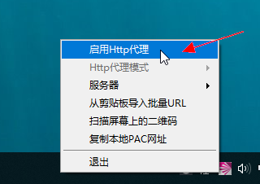
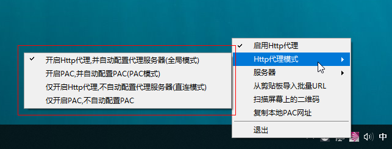

# V2RayN

* `系统要求：Windows XP 及以上（64-bit）`

## 介绍

V2RayN 是一个适用于V2Ray-Core的开源视图化客户端，支持订阅。

## 下载

版本:2.20 \| 更新日期: 2018-12-27

[本地下载](https://ivynet.fun/dl.php?type=d&id=11) \| [官](https://github.com/2dust/v2rayN/releases/download/2.20/v2rayN-Core.zip)[方下载](https://github.com/2dust/v2rayN/releases/download/2.20/v2rayN-Core.zip)

## 运行

* 将您下载的压缩包解压到任意目录，建议放在非系统盘的目录里，避免带来权限问题。
* 运行其中的 `V2RayN.exe`
* Windows 10 第一次运行可能会提示被阻止，点击「更多信息」 - 「仍要运行」

## 配置订阅

1.进入您的[产品中心](https://ivynet.fun/clientarea.php)，点击对应套餐进入套餐详情，用户信息区域，订阅区域点击**通用订阅链。**

2.打开V2RayN，点击**订阅**-&gt;**订阅设置，**在跳出的窗口里，备注**常青藤**，**地址URL**位置粘贴刚才复制的订阅链，确定退出订阅设置。

3.点击**更新订阅**，显示订阅成功即可。

## 参数设置建议

点开主面板的参数设置

* 建议打开Mux多路复用

* Core路由设置：建议打开绕过大陆IP和大陆网址，以提升访问国内网站体验。

## 设置系统代理，选择服务器

* 右键点击右下角V2RayN小图标，启动HTTP代理，并且在模式中选择以下：
  * 全局模式：所有的网站/程序HTTP流量都将通过V2RayN
  * PAC模式：根据规则匹配，只有PAC列表内网站会通过V2RayN
  * 直连模式：仅开启HTTP代理，不设置统代理，您可以通过其他工具，如SwithyOmega浏览器插件，来配置流量转发
  * 仅开启PAC：不推荐

* 在服务器选项，可以选择任意服务器，选择后自动切换该服务器

