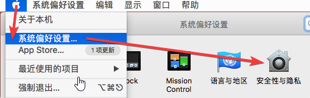
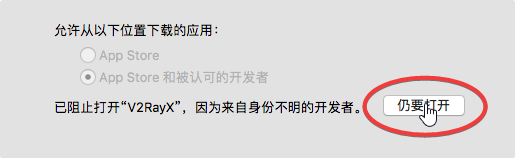
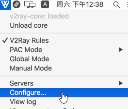
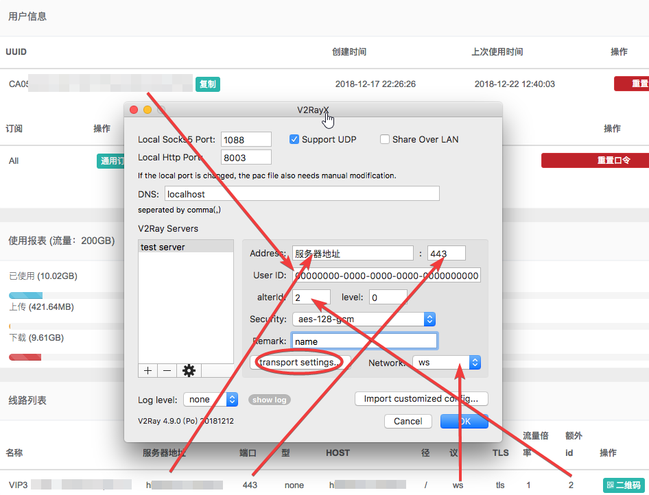
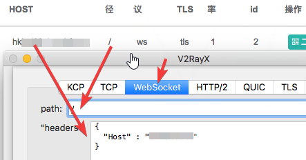
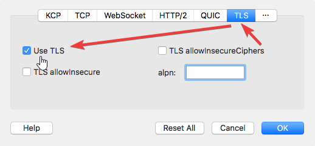
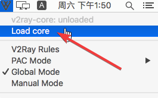

# V2RayX

* `系统要求：macOS 10.5 及以上`
* `设备要求：MacBook / iMac / Mac Pro`

## 介绍

V2RayX 是一个适用于V2Ray-Core的开源视图化Mac客户端。支持V2Ray全功能，但设置极为麻烦，不推荐用户使用，仅适合希望能最大化自定义参数的用户。

## 下载

版本:1.5 \| 更新日期: 2018-12-27

[本地下载](https://xn--rut069fptl.club/dl.php?type=d&id=12) \| [官方下载](https://github.com/Cenmrev/V2RayX/releases/download/v1.5.0/V2RayX.app.zip)

## 使用

* V2RayX是开源工具，但未经Apple认证，所以会跳出安全提示
* 解决办法：
  * 左上苹果图标，系统偏好设置，安全性与隐私
  * 对V2RayX点击仍要打开
  * 重新打开V2RayX

* 右上角V2rayX图标，下拉菜单点配置

* 打开网站用户面板，根据网站提供参数填写基本配置，网站没有标注的地方使用默认值。填写完成后，点开transport setting

* transport setting设置：
  * Websocket选项卡：path和headers按网站提供参数填写。值得注意的是，Mac默认打开了标点符号自动替换，输入后会替换掉双引号，导致配置不正确，保存时一定要注意是否被替换
  * TLS选项卡：勾选USE TLS

* 配置完成后，点击小图标菜单中的Load core开启代理

* 由于V2RayX面向的是希望自定义的客户，对系统一般有基本了解，这里不介绍详细功能

