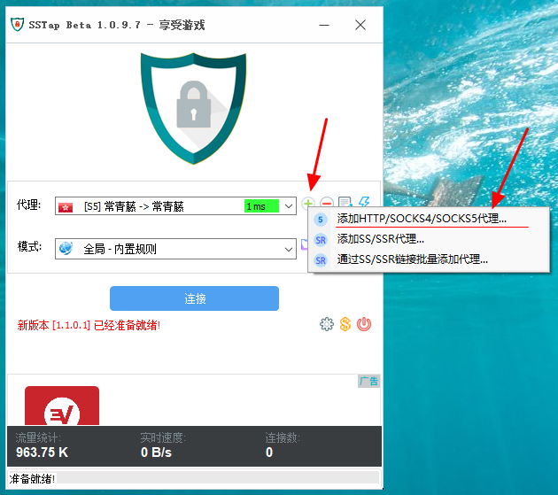

# SS-Tap（游戏/全局）

* `系统要求：Windows 7 及以上`
* `软件版本：经典版SSTap 1.0.9.7`

## 介绍

* SSTAP是一款利用虚拟网卡技术，拦截所有连接并转发给斑马线的代理工具
* SSTAP非常适合游戏，可以将系统代理无法代理的UDP流量转发给加速服务器
* SSTAP启用全局模式后，配合V2Ray的TLS，能达到VPN的流量全加密的效果 

## 下载

版本v1.0.9.7

[点击下载](https://ivynet.fun/dl.php?type=d&id=17)

* 如果你有使用 BitTorrent 协议的需求（各类 BT/PT 下载），则应当避免在使用这些软件时开启 SS-Tap，否则 BitTorrent 流量将有极大可能被 SS-Tap 路由通过斑马线网络，而斑马线的条款和条件中明确指出不允许在斑马线网络上使用BitTorrent 协议，否则将暂时或永久限制订阅或账户访问。
* 作者 Taro 宣称 SS-Tap 的代码没有备份，而储存代码的硬盘因为控制片损坏，永久丢失了这些代码，并决定放弃 SS-Tap 的开发，因此，SS-Tap 将可能在未来的系统更新中出现意料之外的问题或无法使用。

## 安装使用

下载解压后安装，安装过程中将可能提示，无需担心，这是因为 SS-Tap 需要使用 OpenVPN 的 TAP 设备驱动来创建虚拟网卡以实现类似 VPN 的效果。为了 SS-Tap 能正常运行，请点击「安装」。

* 打开 SS-Tap，点+号后添加一个Socks5服务器

* 跳出窗口内填入必要信息，端口填入代理工具监听的内网Socks5端口。V2RayN默认为1080，Clash默认为7891。附加路由填入想要用于加速的节点域名，保存返回主界面。

* 启动和SSTAP填写的域名保持一致的代理工具节点，然后点击雷电小图标测试连接

* 测试通过后，点连接即可加速您的网络。
* 加速游戏时，请讲V2RayN或Clash调整至全局模式

