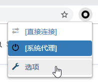
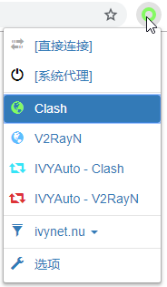
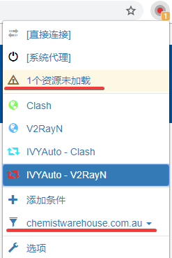
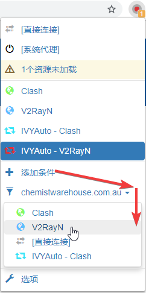

# SwitchyOmega浏览器插件

## 介绍

SwitchyOmega是一款Chrome和Firefox 浏览器上的代理扩展程序，可以轻松快捷的管理和切换多个代理设置，情景模式支持多种规则（自定义，PAC，GFWList）自动切换，非常方便。

## 安装

国内大部分浏览器都采用了Chrome内核，推荐使用代理工具全局模式进入Chrome应用商店下载。Firefox浏览器需要从Firefox应用商店下载。

[Chrome 应用商店](https://chrome.google.com/webstore/detail/padekgcemlokbadohgkifijomclgjgif) \| [Mozilla Add-Ons](https://addons.mozilla.org/en-US/firefox/addon/switchyomega/)

## 配置

为方便使用，常青藤团队提供配置好的SwithyOmega配置文件，包含最新的分流规则以及自动切换模式，请下载对应的备份文件导入。

[点击下载配置文件](https://xn--rut069fptl.club/dl.php?type=d&id=16)

导入方法：

* 点击浏览器工具栏SwitchyOmega图标，选择**选项**

* 在打开的窗口选择**导入/导出**，从备份文件恢复

* 选中刚才下载的配置文件，确定。
* 关闭SwitchyOmega配置窗口，重新点击浏览器工具栏SwitchyOmega图标，会发现配置已正确导入

* 模式说明
  * 直接连接：忽略系统代理，流量走默认通道
  * 系统代理：使用系统设置的HTTP代理
  * Clash/V2RayN：浏览器流量全部转发Clash/V2RayN
  * IVYAuto：浏览器浏览由内置的规则判定，需代理的流量发送到Clash/V2RayN，其他流量走直连

## 可选操作：规则微调

很多海外网站可以正常访问，因此并未加入各种流行的规则列表里，但是使用加速器后能显著改善浏览体验，所以需要对规则进行个性化微调，这里以澳洲Chemist Warehouse为例

打开网站，并未激活自动规则走代理，但是出现1个资源未加载并网页打开速度非常缓慢

这时候点击未加载位置，跳出界面将无法加载的域名选入代理

同时由于网站打开缓慢，点击图1域名位置，将该域名也加入代理列表

这时候重新打开网站，能发现已激活代理，加载速度飞快并且无法加载的资源已消失

