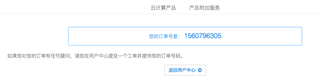

# 注册与购买流程

### 注册购买流程

* 浏览器访问：[https://ivynet.fun/cart.php?gid=1](https://ivynet.fun/cart.php?gid=1)，选择Basic Plan套餐，点击立即订购

* 付款周期选择月付

* 输入您的优惠码：点击验证后，应付金额应当为0，点击结账进入账户注册流程

* 填入注册信息，邮箱地址请务必真实，用于接收产品详情，填写完毕后，点击完成订购，请不要多次点击

* 稍等片刻您的产品就会自动开通，邮箱应当会收到产品开通邮件以及帐户验证码

* 浏览器打开：[https://ivynet.fun/clientarea.php](https://ivynet.fun/clientarea.php)，或者点击菜单左边栏"产品/服务"（手机客户点击左上三横线，选择产品/服务），如未验证邮箱会要求输入邮箱验证码

* 输入邮箱收到的验证码后通过验证后进入产品区，如未收到验证邮件，请检查您的垃圾箱

* 此时服务已开通成功，您可以根据开通邮件里的教程提示安装配置不同平台客户端
* 如有问题请点击网站右下角客服窗口，会有专人客服指导您使用

### 客户端下载地址

1. 客户端百度云下载地址：[https://pan.baidu.com/s/1Br7RZpdFkTFZrNEMmht1Fw](https://pan.baidu.com/s/1Br7RZpdFkTFZrNEMmht1Fw)，验证码b3yv
2. iOS客户端因系统限制，不能提供文件安装包，请使用iPhone/iPad的Safari浏览器打开[https://gogoyun.xyz/](https://gogoyun.xyz/)安装客户端，第一次使用需要输入AppStore密码，请联系网站右下角人工客服获取

